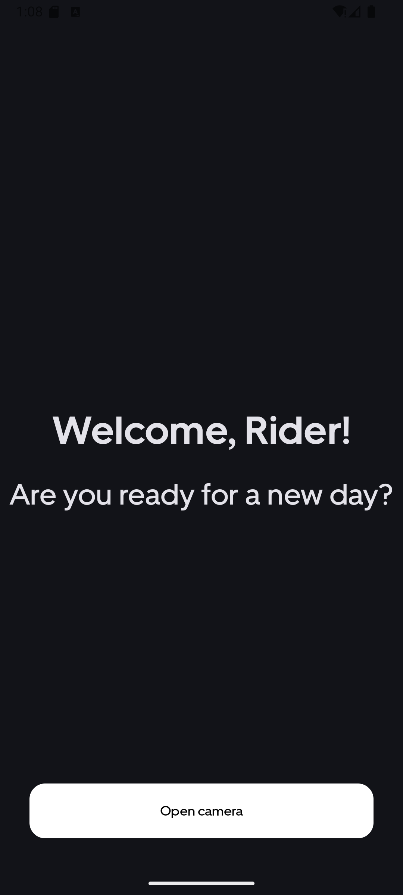
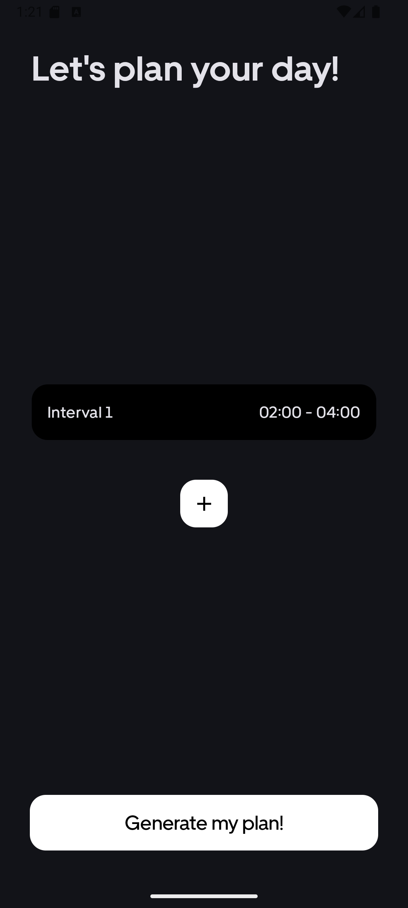

# Earner Utopia
This is Earner Utopia, an Android App meant to be an extension to the existing Uber-Driver app that enhances Earners' experience by taking into account both the money-making and the wellness aspects.

# Problem and Solution
Earners can, in the current Uber application, input their preferred destinations, as well as plan their day based on the areas that are predicted to make them the most money. However, the 
wellness of earners is not currently a priority. 

This is where our companion comes in. We aim to enhance the earner experience through a daily plan based on their preferred schedule, and other wellness-related factors such as 
their tiredness levels, minimizing the idle times between orders, bad weather, and other similar factors. We also provide a floating widget that notifies the driver when they are recommended to take a break from
driving, as well as suggestions to take cover in case of bad weather predictions.

# Getting started
1. In order to run this application, you need to first install [Android Studio](https://developer.android.com/studio).
2. Run `pip install -r requirements.txt` in order to ensure you have all the required python packages installed
3. In the terminal, navigate to `./app/predictors` and run the following command: `python server.py`
4. After cloning and opening the project directory in Android Studio, you can now run the project, either on one of your Android devices, or on a virtual device.

# Future plan
We are aiming to (hopefully) integrate our daily schedule planner as well as our floating widget into the Uber Driver app. In order to do so, we plan on creating an .apk file that would allow both users and developers
to more easily get started with our companion. A current future step that we are working on is deploying the Python Flask service online, so that an individual .apk file may be ran on its own, without needing to start a server every time.

# Walkthrough
1. Once you open the app, you can see this screen, where you can choose to (or not) take a picture, so that your tiredness level is taken into account. 
2. After waiting for a few seconds, for the first time of opening the application, you should see this screen where you can choose a preferred schedule for the day.
3. After being content with your schedule, our model will provide an optimal plan for the day, taking into account both break, as well as driving and delivering orders. This is your plan for the day, which you may choose to either follow, or not!
4. Once you exit the app, you should also be able to see a floating bubble that will sometimes send you notifications related to taking breaks or predictions of bad weather.

